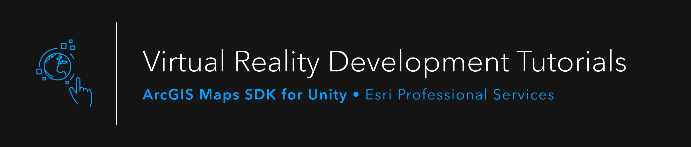

<!-- README GUIDELINES START

Welcome to your InnerSource project's README! 👋

Throughout this file, there will be guidance (marked with comment tags for easy removal) + boilerplate language to get you started quickly. Consistency across project READMEs will help our InnerSource community grow faster – but please feel free to modify this file as much as you need.

The first thing in this template is a banner, which should contain an image, tagline, and any badges you'd like to include with your project. 
  - The image is sourced from `documentation/github-banner.png` so you can easily replace that image with one of your own.
  - If you're unsure what badges are, check out https://shields.io/
  - Here are some nice README banner sections to check out: https://github.com/EsriPS/experience-builder-samples, https://github.com/EsriPS/arcgis-assistant

README GUIDELINES END -->

  

<!-- CONTENTS GUIDELINES START

This section is a simple table of contents to help users navigate your README. GitHub automatically turns your markdown headers into kebab-cased anchor tags, so linking is really simple.

CONTENTS GUIDELINES END -->

<!-- ABOUT SECTION GUIDELINES START

This should contain a brief (1-3 sentences) description of the mission of your project. The goal is to state what you are planning to work on and help both intended users as well as external contributors understand roughly which types of features will be included in this project.

ABOUT SECTION GUIDELINES END -->
  
## About

This repo (currently in progress) contains a URP project showcasing our VR development work, and a HDRP project showcasing Realtime work. These projects are intended to walk the user through a progression of scenes that can be used as teaching tools.

## Getting Started

Whether you plan to explore the VR or Realtime aspect of this repository, there are a number of FBX files that need to be placed in the correct location before you launch these Unity projects for the first time.

* Download all of the [FBX models](https://esriis-my.sharepoint.com/:f:/g/personal/jeff8977_esri_com/EvcKTCBgCF5Hjgr4PSjLeUMBTGd7wtKgntu3n3o2qE_WOQ?e=R1IkZR) to your machine and place them in the **/Assets/Resources/Models** directory of your project. 
* Open Unity Hub and start your Unity project as you would normally. 

<!-- GETTING STARTED SECTION GUIDELINES START

This section should contain brief documentation written for first time users on how to get started using the project. If you have more detailed documentation, you should keep this section but just link users to your docs.

GETTING STARTED SECTION GUIDELINES END -->

<!-- ADDITIONAL GUIDELINES START

You made it to the end 🎉!

Plenty of projects will find it useful to add more to the README than this template includes, so feel free to add more (don't forget to add them to your TOC!). You can also make use of GitHub's Wiki feature if you need a more in-depth, structured option.

If you have any questions, please feel free to reach out in MS Teams – the PS Developers team is a good start, or PS Tech and Delivery > EsriPS GitHub if you have GitHub-specific questions. Feel free to tag Josh Peterson or Gavin Rehkemper in any case.

ADDITIONAL GUIDELINES END -->
